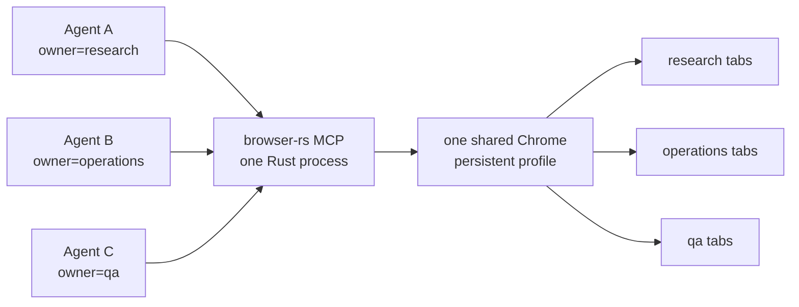
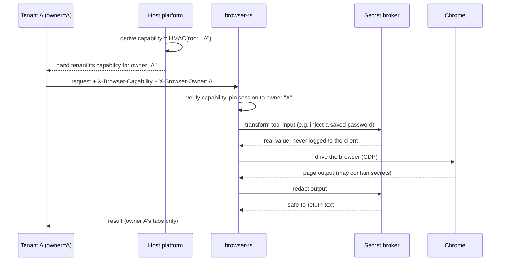

# browser-rs

**One real browser. Many agents. A ~5.5 MB Rust server.**

[](https://github.com/maestrojeong/browser-rs-mcp/actions/workflows/ci.yml)
[](https://github.com/maestrojeong/browser-rs-mcp/releases)
[](LICENSE)


browser-rs is a lightweight, stealth-oriented browser MCP server. It lets
multiple AI agents share one logged-in Chrome — each agent controls only its
own tabs — for parallel scraping, web automation, and QA without every agent
spinning up its own browser. 68 Playwright-style tools, one Rust binary, no
Node.js runtime.



## Why browser-rs?

| | browser-rs | Playwright/Puppeteer-based MCP (Node) |
|---|:--|:--|
| Server runtime | Single Rust binary | Node.js + npm dependency tree |
| Release artifact | ~5.5 MB | Runtime and packages installed separately |
| Server memory¹ | ~6 MB RSS | ~180 MB RSS |
| Multi-agent control | One Chrome, owner-isolated tab groups | Separate coordination required |
| Browser control | Raw CDP over one multiplexed WebSocket | Playwright |

The default mode uses a locally installed, headful Chrome with a persistent
profile and does not inject page patches, minimizing common automation signals.
It does **not** guarantee bot-detection bypass — no automation stack can — but
ships reproducible detector runners under [`bench/`](./bench) so changes can be
tested against current browsers and detectors. See [DESIGN.md](DESIGN.md) for
how the stealth defaults work.

¹ Historical maintainer measurements excluding Chrome, taken from idle local
servers. Exact memory varies by OS, build, runtime, and workload; treat these
figures as an order-of-magnitude comparison, not a benchmark guarantee. The
release binary size can be checked with `du -h target/release/browser-rs`.

## Quick start

**1. Install** — on macOS arm64 and Linux x64 the installer downloads a
prebuilt binary. A locally installed Google Chrome or Chromium is also required.

```bash
curl -fsSL https://raw.githubusercontent.com/maestrojeong/browser-rs-mcp/main/install.sh | sh
browser-rs --help
```

To pin this release instead of following `latest`:

```bash
curl -fsSL https://raw.githubusercontent.com/maestrojeong/browser-rs-mcp/main/install.sh | AB_VERSION=v0.2.2 sh
```

**2. Run** — use stdio for a client that launches the server:

```bash
browser-rs
```

**3. Verify** — point an MCP client at it and drive the browser:

```text
browser_navigate  → https://example.com   # a headful Chrome window opens
browser_snapshot                          # returns the accessibility tree
```

The common workflow is: `browser_snapshot`, act, then inspect the returned
accessibility diff. Most interaction tools accept a snapshot `ref` or a CSS
selector.

Other install options — direct downloads, SHA-256 files, source builds, and
updating a running binary — are in **[INSTALL.md](INSTALL.md)**. To build from
source:

```bash
cargo install --git https://github.com/maestrojeong/browser-rs-mcp ab-mcp
```

Set `AB_CHROME` if Chrome is not in a standard location.

<details>
<summary><strong>What's new (v0.1.14 - v0.2.2)</strong></summary>

**v0.2.2 — closed-shadow/iframe hit-testing, real clipboard, chrome.runtime
fidelity.** Actionability hit-testing (used before every ref-based click) is
now Runtime-free and pierces closed shadow roots — including inside iframes —
via `Page.getLayoutMetrics` + `DOM.getNodeForLocation` +
`Accessibility.getPartialAXTree`, instead of a main-world
`document.elementFromPoint` call that always failed for closed-shadow targets.
The same target is re-verified immediately before every `mousePressed` (not
just once before the human-like travel), so a hover-menu closing mid-move
fails loudly instead of silently pressing the wrong element.
`browser_iframe_click` gained the same closed-shadow-piercing resolution, and
a new `browser_iframe_hover` tool lets a hover-to-reveal menu inside an
iframe open without any manual coordinate math. Modifier-combo key dispatch
(`Meta+c`, `Ctrl+v`, …) now attaches the matching `Input.dispatchKeyEvent`
`commands` (Copy/Paste/Cut/SelectAll) — CDP-synthesized key events bypass
Chrome's native UI accelerator table, so Copy/Paste never reached the real OS
clipboard without this. The `chrome.runtime` shim gained the six frozen
extension-API enums (`OnInstalledReason`, `OnRestartRequiredReason`,
`PlatformArch`, `PlatformNaclArch`, `PlatformOs`, `RequestUpdateCheckStatus`)
real Chrome exposes even with no extension installed — their total absence
was previously the single biggest passive-fingerprint tell.

**v0.2.1 — input-layer and stealth hardening.** Character key events now carry
a real US-QWERTY `code`/`windowsVirtualKeyCode`/`nativeVirtualKeyCode` alongside
`key`/`text`, closing the `KeyboardEvent.code === ""` / `keyCode === 0` tell.
Long (>=30 char) input now emulates a human Ctrl/Cmd+V paste gesture (trusted
modifier+V key events around the text delivery) instead of a bare, keyless
`Input.insertText`. The JS stealth-patch layer now injects by default in both
headful and headless launches (self-guarding; opt out with `AB_NO_STEALTH=1`),
gained a more realistic `chrome.runtime`/`chrome.csi`/`chrome.loadTimes` shim,
and `browser_fingerprint_check` now also reports WebGL renderer, speech-voice,
`window.chrome`, notification-permission, and viewport-sanity signals.

**v0.2.0 — trusted-only interaction defaults.** Synthetic pointer delivery and
`browser_iframe_fill` have been removed. `browser_iframe_click` now resolves
same-origin, cross-origin, and OOPIF target boxes before dispatching trusted CDP
mouse input; `browser_select_option` uses trusted native-select type-ahead
keyboard events instead of assigning `select.value`. Strict mode is now the
default: console capture is hidden and `browser_evaluate(main_world=true)` is
rejected unless the server starts with `--allow-detectable-tools`. Virtual
WebAuthn authenticators are no longer installed automatically; call
`browser_webauthn` explicitly before a passkey challenge when needed.
JavaScript dialog handling likewise starts only after an explicit
`browser_handle_dialog` call.

**v0.1.23 — trusted iframe typing.** The new `browser_iframe_type` tool
focuses inputs inside same-origin, cross-origin, and out-of-process iframes,
then dispatches browser-generated CDP keyboard input on the innermost frame's
own session. This supports React-controlled and masked inputs that reject
`element.value` assignment plus synthetic DOM events. It shares
`browser_type`'s humanized short-text typing, atomic long-text insertion,
`clear`, blocking-by-default behavior, and `browser_cancel_typing` support.

**v0.1.22 — exact pointer capabilities.** Snapshot refs are unique capabilities
bound to the page target and main-document loader, so navigation and later
snapshots make old refs fail instead of silently retargeting them. The new
`browser_pointer` tool adds right-click, double-click, horizontal/vertical
scroll, and drag through either trusted CDP input or an explicit untrusted
`dom_event` route. Trusted input retains humanized motion; DOM scrolling only
succeeds when the selected scroll container actually moves.

**v0.1.21 — opt-in background typing.** `browser_type` waits for completion
and returns its settle diff by default, preserving the existing action contract.
Pass `wait: false` only when a later `browser_cancel_typing` call is needed.

**v0.1.20 — cancellable typing.** `browser_type` can run keyboard dispatch in
the background so a later `browser_cancel_typing` call can stop it mid-flight.
Long text (≥ 30 chars) uses a single CDP `Input.insertText` instead of
char‑by‑char key events for speed. Call `browser_cancel_typing({page})` to
stop a running typing task mid-flight; already-typed characters remain.

**v0.1.19 — out-of-process iframe support.** Cross-origin iframe actions now
route CDP commands through the iframe target's own flatten-mode session when
Chrome Site Isolation places it in a separate renderer process (OOPIF). The
session is carried together with the execution context through nested frame
chains and reused across calls. This fixes structures such as a same-origin
wrapper containing a cross-origin Kakao postcode iframe. The public iframe
tool interfaces remain unchanged.

**v0.1.18 — nested cross-origin iframe resolution.** The iframe tools now
resolve the selected iframe element directly to its CDP frame ID before
falling back to URL/name matching, keep paths relative to the current frame
context across repeated origin boundaries, and handle frames without `src` or
`name` attributes. OOPIF target-session routing is completed in v0.1.19.

**v0.1.17 — cross-origin iframe support.** `browser_iframe_click` and
`browser_iframe_fill` now work on cross-origin iframes, not just same-origin
ones — same-origin frames still resolve with a single JS round trip, but a
cross-origin boundary automatically falls back to CDP
(`Page.getFrameTree` + `Page.createIsolatedWorld`), which isn't subject to
the Same-Origin Policy. Both tools also support nested iframes via a
Playwright-style `" >> "` chain in `frame_selector` (e.g.
`"iframe.wrapper >> iframe.popup"`). A new `browser_iframe_read` tool reads
`outerHTML`/`innerText` from inside an iframe with the same resolution
logic — use it where `browser_get_visible_html`/`_text`/`browser_snapshot`
can't see past a cross-origin boundary. `browser_snapshot`'s accessibility
tree also now always surfaces iframe nodes (even nameless ones) with a hint
to use these tools, instead of silently pruning them. Frame resolution that
would otherwise be ambiguous (e.g. two sibling iframes sharing a `name` or
overlapping `src`) is rejected with an error rather than silently guessing
and risking action in the wrong origin — see the `frame_selector` docs on
`browser_iframe_click`/`_fill`/`_read` for the current known limitations
(no CSS-aware `>>` escaping, no redirect tracking).

**v0.1.14 — managed hosting security.** browser-rs can now run behind a
trusted host (like an agent platform) that spins up one server for many
tenants. New in this mode: per-owner HMAC capability tokens, a fail-closed
`AB_ALLOWED_TOOLS` allowlist, an optional secret broker that keeps the
credential database and lookup logic out of browser-rs, and graceful shutdown
that cleans up Chrome. See [Managed mode](#managed-mode-secure-multi-tenant-hosting)
below.

**v0.1.15 — safer output limits.** Output truncation (snapshots, HTML, visible
text, API responses) now respects UTF-8 character boundaries instead of
cutting mid-character, and managed hosts can raise the internal limit so the
secret broker redacts *before* truncation, not after.

**v0.1.16 — output-limit hardening.** A caller-supplied `maxLength`/`maxBytes`
(e.g. `usize::MAX`) is now clamped to an absolute ceiling (`AB_MAX_OUTPUT_LIMIT`,
default 5 MB — well above the 100k/200k tool defaults) so one managed tenant
can no longer force an oversized response and degrade the shared process for
everyone else.

Standalone stdio and unauthenticated loopback HTTP — the default for most
users — are unaffected and keep their existing behavior.

</details>

## Connect an MCP client

`browser-rs` speaks standard MCP over stdio — any compliant client connects
with one line of config. Pick yours:

<details>
<summary><strong>Claude Code</strong></summary>

```bash
claude mcp add browser-rs -- browser-rs
```

Registers it for the current project. Add `-s user` to register it globally
for all projects instead. Verify with `claude mcp list`.

</details>

<details>
<summary><strong>Codex CLI</strong></summary>

Add to `~/.codex/config.toml`:

```toml
[mcp_servers.browser-rs]
command = "browser-rs"
```

</details>

<details>
<summary><strong>Claude Desktop</strong></summary>

Add to `claude_desktop_config.json`:

```jsonc
{
  "mcpServers": {
    "browser-rs": {
      "command": "browser-rs"
    }
  }
}
```

</details>

<details>
<summary><strong>Cursor</strong></summary>

Add to `~/.cursor/mcp.json` (global) or `.cursor/mcp.json` (per-project):

```jsonc
{
  "mcpServers": {
    "browser-rs": {
      "command": "browser-rs"
    }
  }
}
```

</details>

<details>
<summary><strong>Gemini CLI</strong></summary>

Add to `~/.gemini/settings.json`:

```jsonc
{
  "mcpServers": {
    "browser-rs": {
      "command": "browser-rs"
    }
  }
}
```

</details>

<details>
<summary><strong>Any other MCP client</strong></summary>

Any MCP-compliant client that launches a stdio server works. The command is
just `browser-rs`, no arguments:

```jsonc
{
  "mcpServers": {
    "browser-rs": {
      "command": "browser-rs"
    }
  }
}
```

</details>

Use HTTP when several agents should share one browser process and profile:

```bash
browser-rs --port 9321
# streamable HTTP: http://127.0.0.1:9321/mcp
# legacy SSE:      http://127.0.0.1:9321/sse
```

Configure the client with `http://127.0.0.1:9321/mcp` for streamable HTTP, or
`/sse` for clients that still use legacy SSE. Keep HTTP on loopback unless it is
behind a trusted, authenticated proxy; non-loopback binds and the
`X-Browser-Capability` header are covered in **[INSTALL.md](INSTALL.md)**.

## Multi-agent tabs

Each HTTP request identifies its topic, worker, or job with a stable owner (via
an `?owner=` query param or the `X-Browser-Owner` header). New tabs are assigned
to the request owner, and each agent lists, switches, and controls only its own
tabs — even though every agent shares the same Chrome process, login state, and
persistent profile. An owner-scoped `browser_close` closes only that agent's
tabs without stopping the browser.

Owner isolation is an in-process scope, not an authentication boundary.
Connections without an owner are administrative and can access all tabs, so do
not expose an ownerless HTTP endpoint publicly. Owner setup, per-owner cleanup,
and capability-header details are in **[INSTALL.md](INSTALL.md)**.

## Managed mode (secure multi-tenant hosting)

Plain multi-agent tabs (above) trust every caller. **Managed mode** is for a
host that runs one browser-rs process for many untrusted tenants — it adds
per-owner authentication and keeps the credential *database* out of
browser-rs. (Secret *values* still pass through browser-rs' memory on their
way to Chrome — the broker keeps the lookup/storage logic and long-term
credentials out, not the in-flight value itself.)



- **Capability tokens** — the host holds one root secret and hands each tenant
  an `HMAC-SHA256(root, owner)` token, so a leaked tenant token can't be used
  to impersonate another owner or reach `/owners` (root-only).
- **Secret broker** — a Unix-socket side-process the host controls. browser-rs
  sends tool *input* through it before acting (e.g. to fill in a real
  credential the tenant never sees) and tool *output* through it again before
  replying (to redact secrets from page text). browser-rs itself never touches
  the credential database, and any broker error or timeout fails closed. Tools
  that return page content (`browser_snapshot`, `browser_get_visible_html`,
  `browser_get_visible_text`, `browser_api_request`) accept an optional
  `maxLength`/`maxBytes` so the host can raise the internal limit and let the
  broker redact *before* the caller-visible truncation is applied.
- **Tool allowlist** — `AB_ALLOWED_TOOLS` restricts which `browser_*` tools a
  managed tenant can even see or call.

**Required** to turn this on: `AB_MANAGED=1` plus both `AB_HTTP_CAPABILITY` and
`AB_SPAWN_NONCE` (the server refuses to start managed without all three).
**Optional**: `AB_SECRET_BROKER_SOCKET` and `AB_SECRET_BROKER_TOKEN` together,
if you want the redaction broker (see [CLI and environment](#cli-and-environment)
for full per-variable semantics). Standalone/self-hosted users can ignore this
whole section — it only activates when a host explicitly configures it.

## Strict anti-detection mode

Strict mode is the default. It hides `browser_console_messages`, which enables
the observable Runtime domain, and rejects `browser_evaluate` with
`main_world: true`. Every public interaction tool uses trusted CDP input;
synthetic DOM pointer/fill routes are not part of the v0.2 API.

Start with `--allow-detectable-tools` (or set
`AB_ALLOW_DETECTABLE_TOOLS=1`) only for an explicit debugging or compatibility
session. `AB_ALLOWED_TOOLS` is still applied as an additional fail-closed
allowlist and cannot override strict mode.

## Tools

MCP implements 68 `browser_*` tools; strict mode advertises 67 by default:

**Navigation and inspection:** `browser_navigate` · `browser_new_page` · `browser_snapshot` · `browser_activate_page` · `browser_read` · `browser_get_visible_html` · `browser_get_visible_text` · `browser_find` · `browser_take_screenshot` · `browser_save_pdf` · `browser_pages` · `browser_tabs` · `browser_switch_page` · `browser_profile` · `browser_status`

**Interaction:** `browser_click` · `browser_pointer` · `browser_wheel` · `browser_type` · `browser_cancel_typing` · `browser_press_key` · `browser_hover` · `browser_select_option` · `browser_fill_form` · `browser_drag` · `browser_file_upload` · `browser_navigate_back` · `browser_wait_for` · `browser_resize` · `browser_evaluate` · `browser_run_code_unsafe` · `browser_iframe_click` · `browser_iframe_hover` · `browser_iframe_type` · `browser_iframe_read` · `browser_close_page` · `browser_close`

Use `browser_activate_page({ "page": "p5" })` before automating a background
tab whose site throttles lazy loading. It calls CDP `Target.activateTarget`,
retries visibility/focus verification, and uses a process-specific macOS
foreground fallback when browser-rs launched Chrome itself. Use
`browser_wheel({ "page": "p5", "delta_y": 700, "x": 650, "y": 500 })` for a
real CDP `mouseWheel` event instead of DOM `window.scrollBy()`.
Use `browser_pointer` for trusted right-click, double-click, scroll, and drag;
v0.2 has no synthetic `input_route`.
`browser_type` uses humanized per-character keys for short text and trusted
atomic insertion for paste/IME-like text of 30 characters or more.
`browser_iframe_type` applies the same input behavior after focusing the target
inside a nested iframe chain and routes OOPIF input through that frame's CDP
session. `browser_iframe_click` and `browser_iframe_hover` use trusted pointer
input and resolve selectors through open or closed shadow roots inside the
target frame. `browser_select_option` performs native select type-ahead with
trusted keys.
`browser_cancel_typing` stops active typing started with `wait: false`; text
already entered remains.

**Network and requests:** `browser_network_requests` · `browser_route_block` · `browser_route_mock` · `browser_route_clear` · `browser_network_state_set` · `browser_api_request`

**Cookies and storage:** `browser_cookie_list` · `browser_cookie_get` · `browser_cookie_set` · `browser_cookie_delete` · `browser_cookie_clear` · `browser_localstorage_list` · `browser_localstorage_get` · `browser_localstorage_set` · `browser_localstorage_delete` · `browser_localstorage_clear` · `browser_sessionstorage_list` · `browser_sessionstorage_get` · `browser_sessionstorage_set` · `browser_sessionstorage_delete` · `browser_sessionstorage_clear` · `browser_storage_save` · `browser_storage_load`

**Diagnostics and page utilities:** `browser_console_messages` · `browser_fingerprint_check` · `browser_handle_dialog` · `browser_highlight` · `browser_hide_highlight` · `browser_webauthn` · `browser_claim_page` · `browser_release_page`

`browser_webauthn` is opt-in and affects only the selected page. Ordinary
navigation leaves Chrome's native WebAuthn/passkey behavior untouched.
`browser_handle_dialog` is also opt-in; without it, alert/confirm/prompt
dialogs retain native Chrome behavior.

## CLI and environment

```text
browser-rs                          # stdio MCP transport
browser-rs --port 9321 [options]    # HTTP MCP transport
  --host <host>            HTTP bind host (default 127.0.0.1)
  --user-data-dir <path>   Persistent browser profile directory
  --profile <path>         Alias for --user-data-dir
  --headless               Run headless
  --headed                 Run headful (default)
  --connect <port|url>     Attach to an existing Chrome
  --stealth                Compatibility no-op (enabled by default)
  --allow-detectable-tools Opt in to observable debugging paths
```

`--port` enables HTTP mode; without it, the server uses stdio. The equivalent
environment variables are `AB_HTTP`, `AB_PROFILE`, `AB_HEADLESS`, `AB_CONNECT`,
`AB_NO_STEALTH`, `AB_CHROME`, and `AB_ALLOW_DETECTABLE_TOOLS`. Set
`AB_NO_STEALTH=1` to disable initialization-script injection for launched
browsers; `--connect` browsers are always left untouched.
`AB_HTTP_CAPABILITY` protects HTTP/SSE requests with `X-Browser-Capability`
and is required for non-loopback binds.

Managed hosts (see [Managed mode](#managed-mode-secure-multi-tenant-hosting)
above) can set:

| Variable | Purpose |
|---|---|
| `AB_MANAGED=1` | Turns on per-owner capability auth for `/sse` and `/mcp` |
| `AB_HTTP_CAPABILITY=<random-root>` | Root secret the host derives per-owner tokens from |
| `AB_SPAWN_NONCE=<random-nonce>` | Reported on `/health` so the host can confirm which process instance is live |
| `AB_ALLOWED_TOOLS=<a,b,c>` | Fail-closed allowlist of callable/visible `browser_*` tool names |
| `AB_ALLOW_DETECTABLE_TOOLS=1` | Opt in to main-world JS and Runtime-enabled console capture |
| `AB_SECRET_BROKER_SOCKET`, `AB_SECRET_BROKER_TOKEN` | Unix-socket broker that injects secrets into tool input and redacts them from tool output |
| `AB_MAX_OUTPUT_LIMIT=<bytes>` | Absolute ceiling any caller's `maxLength`/`maxBytes` is clamped to (default 5,000,000 — already far above the 100k/200k tool defaults, so it only matters if a host needs a different bound) |

Secret-bearing variables (`AB_HTTP_CAPABILITY`, `AB_SPAWN_NONCE`,
`AB_SECRET_BROKER_TOKEN`) are removed from the process environment before
Chrome launches, so neither Chrome nor its renderers ever see them.
`AB_MANAGED` and `AB_ALLOWED_TOOLS` are not secrets and are left in place.

These variables are not independent switches — mixing them incorrectly fails
startup or silently changes standalone behavior:

- `AB_MANAGED=1` **requires** both `AB_HTTP_CAPABILITY` and `AB_SPAWN_NONCE` to
  also be set, or the server refuses to start.
- `AB_HTTP_CAPABILITY` set **without** `AB_MANAGED=1` still enables simple
  capability-header auth on standalone HTTP — it is not managed-mode-only.
- `AB_SECRET_BROKER_SOCKET` and `AB_SECRET_BROKER_TOKEN` must be set **together**;
  supplying only one fails startup.
- `AB_ALLOWED_TOOLS` restricts tool discovery/invocation in **every** mode,
  including plain stdio — it is not limited to managed hosts.

For `--connect`, start Chrome with an explicit remote debugging port, then pass
that port or its URL:

```bash
google-chrome --remote-debugging-port=9222
browser-rs --connect 9222
```

## Development

Requirements: Rust 1.85 or newer, Chrome/Chromium, and Node.js for the optional
benchmark scripts.

```bash
cargo test --workspace
cargo build --release -p ab-mcp
```

The `bench/` directory contains local detector and browser comparison runners.
They are regression tools whose results depend on browser versions, sites, and
detectors; they are not compatibility or stealth guarantees:

```bash
node bench/run.mjs target/release/browser-rs
node bench/external.mjs target/release/browser-rs
node bench/rebrowser.mjs target/release/browser-rs
```

See [DESIGN.md](DESIGN.md) for architecture and tradeoffs. The source is
organized into `ab-cdp` (CDP transport), `ab-browser` (browser and page logic),
and `ab-mcp` (the MCP server).

<details>
<summary><strong>Release (maintainers)</strong></summary>

Update `workspace.package.version` in `Cargo.toml`, then commit and tag:

```bash
git commit -am "Release vX.Y.Z"
git tag vX.Y.Z
git push origin main vX.Y.Z
```

The `v*` tag workflow builds macOS arm64 and Linux x64 binaries, publishes
SHA-256 files, and attaches them to the GitHub Release. `install.sh` fetches the
latest release by default; set `AB_VERSION=vX.Y.Z` to pin one.

</details>

## FAQ

**What is browser-rs?** browser-rs is an MCP (Model Context Protocol) browser
server — it exposes a real, stealth-oriented Chrome to AI agents as a set of
tools (navigate, click, type, snapshot, etc.), so any MCP-compatible client
can drive a browser without writing Playwright/Puppeteer glue code itself.

**Can multiple AI agents share one browser?** Yes — that's the main reason
browser-rs exists. One Chrome process and one persistent, logged-in profile
are shared across agents; each agent gets its own owner-scoped tab group and
can only see/control its own tabs. See [Multi-agent tabs](#multi-agent-tabs).

**Is browser-rs a Playwright or Puppeteer alternative?** It solves a similar
problem — programmatic browser control — but ships as a single ~5.5 MB Rust
binary with no Node.js runtime or npm dependency tree, talks to Chrome over
raw CDP, and is designed from the start for many agents sharing one browser
rather than one script owning one browser instance.

**Does browser-rs bypass bot detection?** No tool can guarantee that. The
default headful mode with a persistent profile and no injected page patches
avoids common automation signals, and [`bench/`](./bench) has reproducible
detector runners to track regressions — but this is not a bypass guarantee.
See [DESIGN.md](DESIGN.md).

**What is managed mode / multi-tenant hosting?** An opt-in mode for a host
platform running one browser-rs process for many untrusted tenants, adding
per-owner HMAC capability auth, a tool allowlist, and an optional secret
broker so long-term credentials never enter browser-rs. See
[Managed mode](#managed-mode-secure-multi-tenant-hosting).

## Related projects

- **[Negotium](https://github.com/maestrojeong/negotium)** — a self-hosted AI
  agent runtime whose built-in browser tools run on browser-rs.

## License

Apache-2.0. See [LICENSE](LICENSE).
